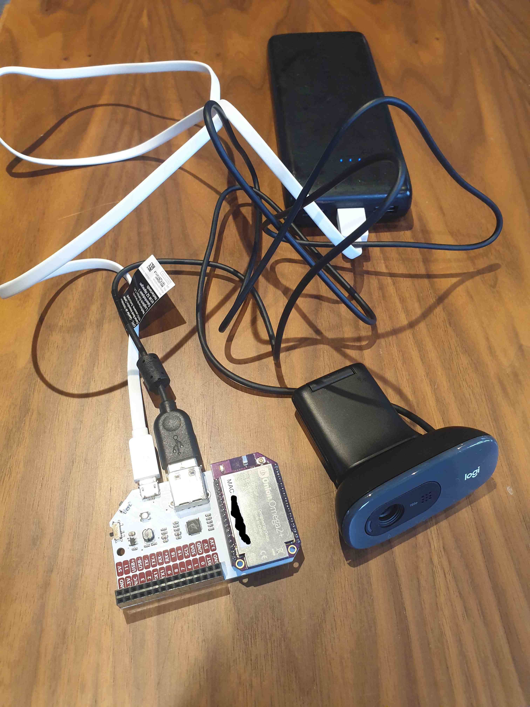

# auto-human

This is currently very much WIP (Work in Progress) but releasing in case anyone wants to have a shot. The cat detector is the first part of a bigger project to automatically feed / play with the cats when we are at work (but that's all there is so far).

It's mostly stitched together from these tutorials (all copyright and what have you remains with the authors):
- [OpenCV cat detector](https://www.pyimagesearch.com/2016/06/20/detecting-cats-in-images-with-opencv/)
- [Python Telegram Bot](https://github.com/python-telegram-bot/python-telegram-bot)
- [Webcam on Onion Omega](https://onion.io/streaming-video-over-wifi/)

This is what the hardware looks like at the moment. But you can use a laptop webcam instead if you can set up something like mjpg-streamer.



At some point you will need to create a `.env` file with your urls/tokens etc. Mine looks something like this:

```
TOKEN='XXXXXXXXXXXXXXX'
CAM_URL='omega-XXXX.local:8000'
```

<small>Hey This Cat is Chonky folk</small> :wave:
